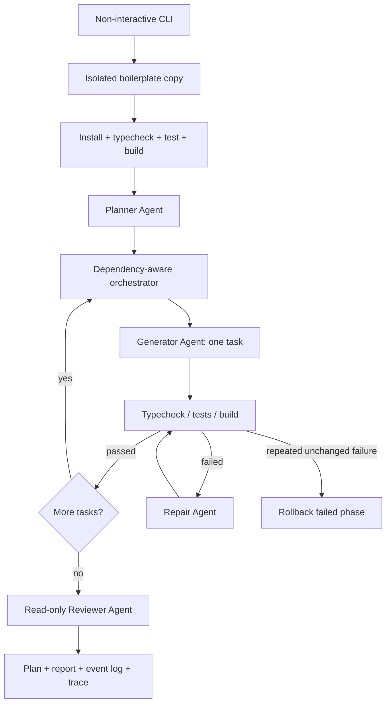

# Agentic Frontend Code Generator

A TypeScript CLI that turns a natural-language application specification into
a runnable React application using the existing repository boilerplate. The
workflow plans the work, generates one dependency-aware phase at a time,
validates the result, repairs failures, and performs a final read-only review.

## Deliverables

- Agent source: [`agent/src`](./agent/src)
- Permanent agent prompts: [`agent/prompts`](./agent/prompts)
- Replaceable sample specification: [`agent/specs/sample-spec.txt`](./agent/specs/sample-spec.txt)
- Runnable generated example: [`sample-output`](./sample-output)
- Required environment variables: [`.env.example`](./.env.example)

The agent contains no hardcoded car-inventory requirements. The car application
exists only in the replaceable sample specification.

## Requirements

- Node.js 22.12 or newer
- npm
- An OpenAI API key

## Setup

Install the boilerplate and agent dependencies:

```bash
npm install
npm --prefix agent install
```

Create the local environment file:

```bash
cp .env.example .env
```

PowerShell equivalent:

```powershell
Copy-Item .env.example .env
```

Set your key in `.env`:

```dotenv
OPENAI_API_KEY=sk-...
# Optional: OPENAI_MODEL=gpt-5.6-luna
```

## Run the agent

From the repository root:

```bash
npm run agent -- --spec ./agent/specs/sample-spec.txt --output ./generated-app --verbose
```

- `--spec` accepts any non-empty UTF-8 natural-language specification.
- `--output` must be a child directory of this repository. It is recreated from
  the clean boilerplate on every run.
- `--model` optionally overrides `OPENAI_MODEL` and the Agents SDK default.
- `--verbose` prints file inspection and detailed validation events.

The CLI writes the ordered plan, final report, and JSONL event log to
`agent/runs/<run-id>/`. OpenAI tracing is also grouped by run ID.

## Run the generated application

```bash
cd generated-app
npm install
npm run typecheck
npm test
npm run build
npm run dev
```

The frontend is then available at the URL printed by Vite, normally
`http://localhost:5173`.

## Verify the included sample output

The committed `sample-output` directory can be evaluated without an API key:

```bash
cd sample-output
npm install
npm run typecheck
npm test
npm run build
npm run dev
```

The committed sample currently passes TypeScript checking, four tests, and a
production build.

## Architecture



### Agent roles

- **Planner:** converts the specification and focused boilerplate context into a
  Zod-validated, dependency-aware implementation plan. It cannot edit files.
- **Generator:** implements one task at a time using typed filesystem tools.
- **Validator:** runs only allowlisted commands: install, typecheck, tests, and
  build.
- **Repairer:** receives the failed command and diagnostics, inspects relevant
  files, proposes a focused correction, and retries validation.
- **Reviewer:** checks requirement coverage and code quality after all phases
  pass; it is read-only.

## Design decisions

- **Structured outputs:** Planner, Generator, Repairer, and Reviewer responses
  are validated with Zod instead of relying on free-form parsing.
- **Scoped context:** each phase receives the specification, current task,
  completed dependencies, project summary, and directly related files rather
  than the entire repository.
- **Safe tools:** writes are limited to relative paths declared by the current
  task; shell execution is restricted to known npm commands.
- **Transactional phases:** task files are snapshotted before generation. A
  failed phase is rolled back so unvalidated changes cannot degrade the last
  passing state.
- **Bounded recovery:** validation failures allow up to four repair attempts,
  with early stopping after two consecutive unchanged failures.
- **Boilerplate preservation:** generation occurs in an isolated copy; the
  original project is never edited by the agents.
- **Observability:** terminal progress, JSONL events, structured run reports,
  and OpenAI traces expose the active agent and workflow state.

## Model choice and approximate cost

Sample runs used the installed OpenAI Agents SDK default,
`gpt-5.6-luna`, through the Responses API. It was kept as a single model across
roles to minimize configuration and provide a cost-efficient balance for
structured output and tool-heavy, multi-call workflows. A different model can
be selected with `OPENAI_MODEL` or `--model`.

Exact token usage is not yet persisted in the run report. Based on the observed
sample workflow (one planning call, multiple phase/tool turns, occasional
repairs, and final review), a representative run is estimated at roughly
200k-500k input tokens and 20k-50k output tokens. At the current documented
`gpt-5.6-luna` rates of $0.20/M input tokens and $1.20/M output tokens, that is
approximately **$0.06-$0.16 per run**. Actual cost varies with specification
size, task count, files inspected, and repair attempts. See the
[official model page](https://developers.openai.com/api/docs/models/gpt-5.6-luna).

## What worked well

- Role separation kept planning, implementation, repair, and review focused.
- Existing boilerplate examples and dependencies were reused instead of
  scaffolding another stack.
- Validation-driven repairs recovered from real TypeScript and test failures.
- Write allowlists, bounded retries, and rollback made autonomous changes safer.
- The sample specification can be replaced or modified without changing agent
  code or permanent prompts.

## What I would improve with more time

- Persist per-agent token usage and exact cost in `report.json`.
- Add automated browser-based visual and accessibility validation.
- Add prompt/model evaluation fixtures for modified specifications.
- Route simple planning/review tasks and complex repairs to different models.
- Cache stable project summaries and unchanged file context between phases.

## Project checks

```bash
npm run typecheck
npm test
npm run build
npm run agent:typecheck
npm run agent:test
```
